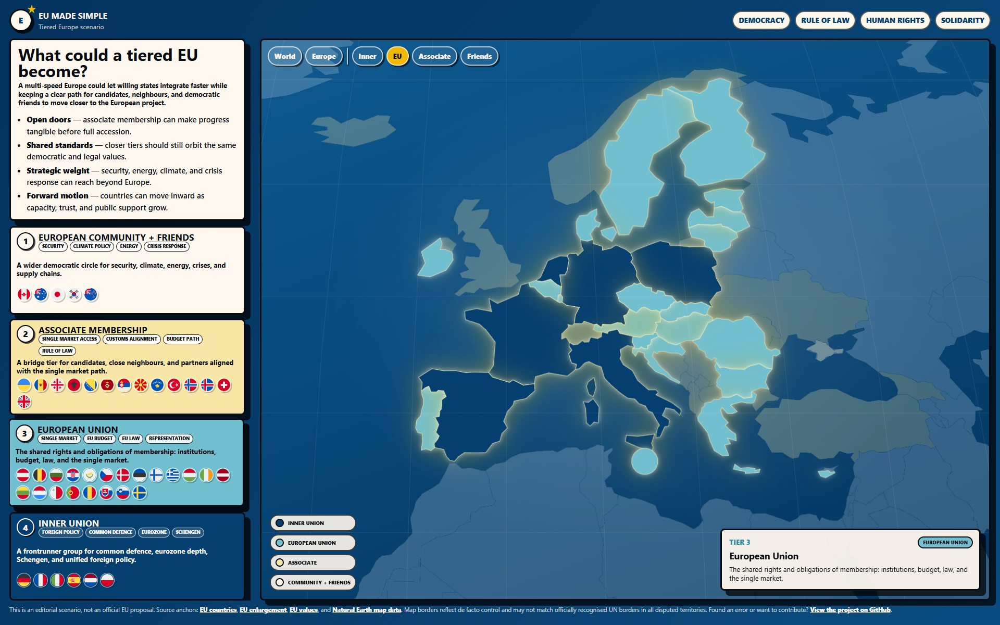

# EU Made Simple — Tiered Europe

[](https://github.com/Microhive/EUMadeSimpleTieredEU/actions/workflows/deploy.yml)

An interactive infographic exploring what a tiered European Union could look like. Countries are grouped into four integration tiers — Inner Union, European Union, Associate Membership, and Community + Friends — and displayed on an interactive world map.

**Live site:** https://microhive.github.io/EUMadeSimpleTieredEU/



---

## What it shows

The scenario proposes a multi-speed Europe where willing states can integrate faster while keeping a clear path for candidates, neighbours, and democratic friends to move closer to the European project.

| Tier | Description |
|------|-------------|
| **Inner Union** | A frontrunner group for common defence, eurozone depth, Schengen, and unified foreign policy |
| **European Union** | The shared rights and obligations of membership: institutions, budget, law, and the single market |
| **Associate Membership** | A bridge tier for candidates, close neighbours, and partners aligned with the single market path |
| **Community + Friends** | A wider democratic circle for security, climate, energy, crises, and supply chains |

This is an editorial scenario, not an official EU proposal. Source anchors: [EU countries](https://european-union.europa.eu/principles-countries-history/eu-countries_en), [EU enlargement](https://european-union.europa.eu/principles-countries-history/eu-enlargement_en), [EU values](https://european-union.europa.eu/principles-countries-history/principles-and-values_en). Map data from [Natural Earth](https://www.naturalearthdata.com/).

---

## Tech stack

- **Vite** — build tool and dev server
- **TypeScript** — typed application logic
- **D3.js** — map projection, zoom, and data binding (loaded as vendor script)
- **TopoJSON** — world topology at 110m and 50m resolution
- **circle-flags** — circular flag SVGs for country chips

---

## Getting started

```bash
pnpm install
pnpm dev
```

Open http://127.0.0.1:5173/

### Build

```bash
pnpm build
```

Output goes to `dist/`.

---

## Deployment

Pushes to `main` automatically deploy to GitHub Pages via the included workflow at [`.github/workflows/deploy.yml`](.github/workflows/deploy.yml).

To enable it, go to **Settings → Pages** in the repository and set **Source** to **GitHub Actions**.

